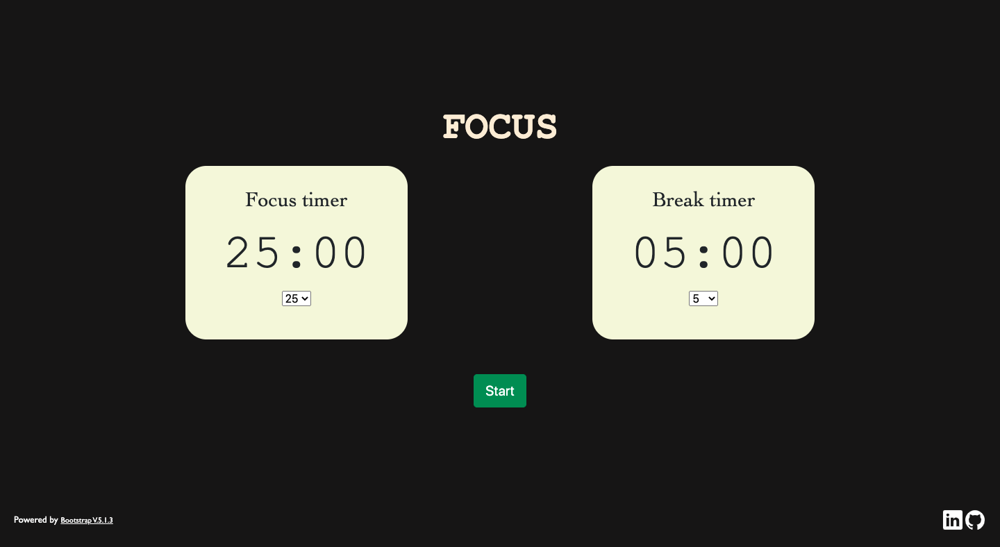
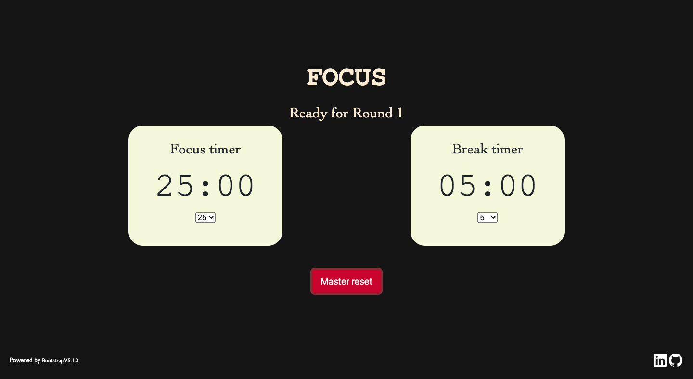
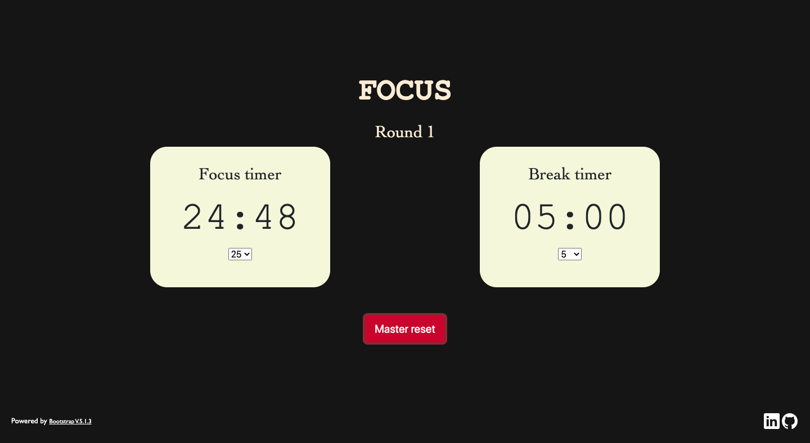

 # 
  [Focus with Amal](https://focuswithamal.netlify.app/) 

### 
 Version 1.0.0 

 &nbsp;&nbsp;&nbsp;&nbsp;&nbsp;&nbsp;&nbsp;&nbsp;&nbsp;&nbsp;&nbsp;&nbsp;&nbsp;&nbsp;&nbsp;&nbsp;&nbsp;&nbsp;&nbsp;&nbsp;&nbsp;&nbsp;&nbsp;&nbsp;&nbsp;&nbsp;&nbsp;&nbsp;&nbsp;&nbsp;&nbsp;&nbsp;&nbsp;&nbsp;&nbsp;&nbsp;&nbsp;&nbsp;&nbsp;&nbsp;&nbsp;&nbsp;&nbsp;&nbsp;&nbsp;&nbsp;&nbsp;&nbsp;&nbsp;&nbsp;&nbsp;&nbsp;&nbsp;&nbsp;&nbsp;&nbsp;&nbsp;&nbsp;&nbsp;&nbsp;&nbsp;&nbsp;&nbsp;&nbsp;&nbsp;&nbsp;&nbsp;&nbsp;&nbsp;&nbsp;&nbsp;&nbsp;&nbsp;&nbsp;&nbsp;&nbsp;&nbsp; 

This project is a simple web app emulating a 3 round [pomodoro](https://en.wikipedia.org/wiki/Pomodoro_Technique) timer. You can use it to study, edit, write, code/debug etc. Pretty much any task that can be done in cycles of focus periods and breaks in between to reset. Open in a new window of your browser and run the timer (do not close or minimise while running). 
 

 **Tech Stack** : 
 
 - HTML 5
 - Bootstrap V.5.1.3
 - Javascript (Node V.18.2.0)
     * Runtime dependencies: None
     * Dev dependencies: browserify v.17.0.0

